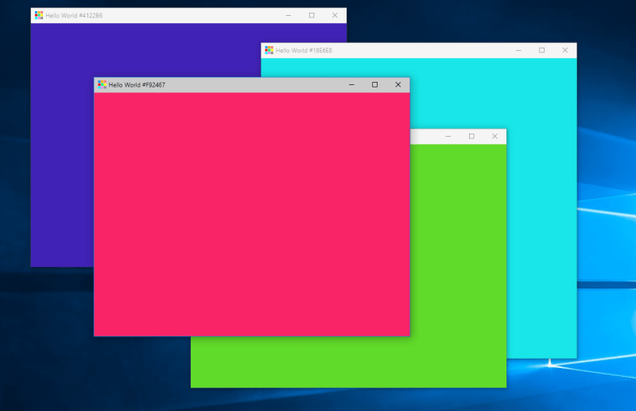

# Hello World Random Color
Hello World Random Color is a Hello World Progressive Web App (HWPWA) that displays a beautiful random color, instead of the traditional "Hello, World!".

### Moved to Glitch: https://glitch.com/~hello-world-random-color

## Screenshots

## Development

Hello World Random Color is hosted on GitHub Pages, and served from the [/docs](docs) folder.

Prerequisites: [Git](https://git-scm.com/), [Node.js](https://nodejs.org/en/), [Workbox](https://developers.google.com/web/tools/workbox/). Editor: [Visual Studio Code](https://code.visualstudio.com/).

## Contributions

Contributions are welcome: code, text, documentation, design, graphics, suggestions. Please fork this repository and contribute back using [pull requests](https://github.com/TecdropArchive/hello-world-random-color/pulls), or [submit an issue](https://github.com/TecdropArchive/hello-world-random-color/issues).

## License

Hello World Random Color is licensed under the [MIT License](LICENSE).
